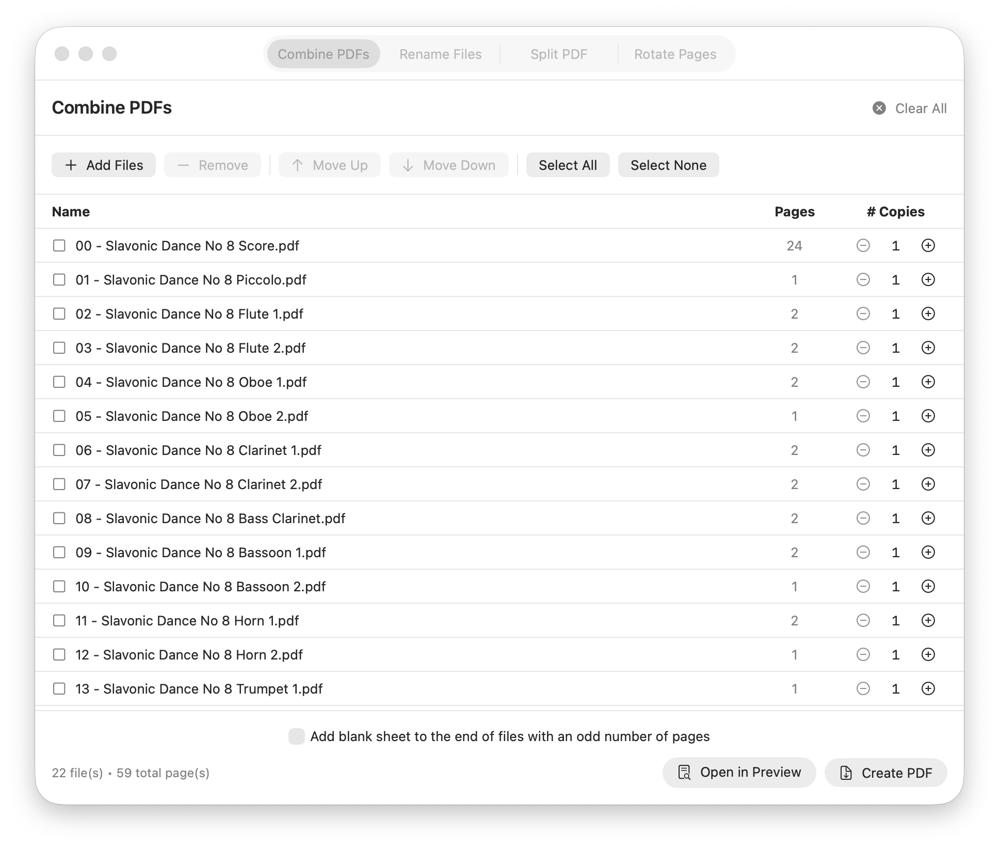

# ScoreSort

A powerful macOS application for managing music PDFs with four tools for musicians and music librarians: PDF combining with smart copy management, automatic file renaming and bulk part renaming, PDF splitting with smart instrument naming, and page rotation.

## Features

### 📎 PDF Combiner
Combine multiple PDF files into a single document with flexible copying and page management.

- **Drag-and-drop or browse** to add PDF files or images (JPEG, PNG, TIFF, HEIC, BMP, GIF); multi-frame TIFFs appear as a single entry with the correct page count
- **Add blank pages** — insert a blank A4 page at any position in the list
- **Specify copies** for each file (great for printing multiple parts)
- **Collate groups** — select files and press `C` to create a group whose copies are printed *interleaved*: 4 copies of [Perc 1, Perc 2, Timpani] → P1, P2, T, P1, P2, T, … ready to hand out by player
- **Reorder files** with Move Up/Down buttons; groups always move as a unit
- **Ensemble Presets** — save named instrument lists (Wind Band, Jazz Band, Orchestra, or your own) with per-part copy counts; drag in files, click "Apply to Files" and copy counts are set automatically
- **Smart preset matching** — handles roman-numeral filenames (Violin I/II → matches Violin 1/2 preset parts) and single-file consolidation (one Flute.pdf against Flute 1 + Flute 2 in preset → summed copies)
- **Smart blank pages** — automatically add blank sheets after odd-page files for double-sided printing
- **Automatic table of contents** — the combined PDF includes bookmarks for each file, visible in Preview's sidebar; multiple copies are labelled "Filename 1/3", "Filename 2/3", etc.
- **Open in Preview** — opens combined PDF in Preview for quick printing (⌘P)
- **Or save to file** — create a permanent combined PDF document
- **Selection tools** — Select All, Select None, Remove selected files
- **Live preview** — see total file and page counts as you build

### 📁 Sheet Music Renamer
Two tools in one tab for organising sheet music filenames.

**Score Order Sorter** (drag a folder onto the left side)
- **Automatic instrument detection** from existing filenames
- **Sequential numbering** (Score = 00, instruments start at 01)
- **Three ensemble presets**: Wind Band, Jazz Band, and Orchestra
- **Customisable instrument order** — edit, reorder, add, or remove instruments in Preferences
- **Manual override** for files that can't be auto-detected
- **Error checking** — rescan already-numbered files to find and fix mistakes
- **Smart detection** — handles "bass clarinet" vs "clarinet" correctly
- **Live preview** — see all changes before executing

**Bulk Part Renamer** (drag a folder onto the right side)
- **Rename files from scratch** — ideal for downloads from IMSLP or scan batches with unhelpful names
- **Set a base name** shared across all files (e.g. *Beethoven Symphony 5*)
- **Smart instrument autocomplete** — suggestions ordered by likely ensemble position, with cross-instrument and numbered progression
- **Page crop preview** — zoomed view of each file's first page with a minimap so you can see exactly where you're looking on the page
- **Optional score-order prefix** — toggle to apply sequential numbering in one extra step

### ✂️ PDF Splitter
Split a large PDF — for example a complete scan of all parts bound together — into separate instrument files.

- **Visual page preview** with keyboard navigation (including first/last page jumps)
- **Click-to-toggle split points** directly on the page strip
- **Auto-split by stride** — split every N pages with a single click
- **Bookmark-aware loading** — if the PDF was produced by ScoreSort's combiner, split points and file names are pre-populated automatically from the embedded table of contents
- **Three-step workflow** — Step 1: mark split points; Step 2: name each output file; Step 3 (optional): apply score-order prefix numbering
- **Smart naming stage** — zoomed-in crop of each file's first page shows the instrument name corner, with a minimap overlay so you can orient yourself on the page
- **Instrument name autocomplete** — suggestions drawn from all ensemble presets, ordered by what's most likely to come next; automatically advances to the next instrument family (e.g. "Oboe 1" after "Flute 2")
- **Arrow-key dropdown navigation** — ↓/↑ moves through suggestions without leaving the keyboard; Return accepts, Escape dismisses
- **Filename validation** — illegal characters (/ : \\) flagged inline before saving
- **Base filename** shared across all output files; per-file suffix appended automatically

### 🔄 Page Rotator
Rotate PDF pages with flexible options for whole-document and per-page corrections.

- **Base rotation** for all pages (90°, 180°, 270°)
- **Additional rotation** for odd or even pages only — useful for double-sided scans with alternating orientations
- **Individual page rotation** — rotate just the current page left or right without affecting others
- **Before/after preview** for each page
- **Perfect for fixing scanned documents** with mixed or incorrect orientations

## Screenshots


*Quickly create arbitrary copies of a number of files ready for printing*


*Automatic sheet music file renaming with instrument detection*


*Split PDFs with visual preview and custom naming*


*Rotate pages with before/after preview*

## Installation

### Requirements
- macOS 14.0 (Sonoma) or later

### Download from the App Store
*(Coming soon)*

### Download from GitHub

1. Download the latest `ScoreSort.zip` from the [Releases](https://github.com/benperche/ScoreSort/releases) page
2. Unzip it and move **ScoreSort.app** to your Applications folder
3. Double-click to open — macOS will show *"ScoreSort cannot be opened because it is from an unidentified developer"*
4. Open **System Settings → Privacy & Security**, scroll down, and click **Open Anyway**
5. Confirm in the dialog that appears — you'll only need to do this once

### Building from Source

1. Clone the repository:
```bash
git clone https://github.com/benperche/ScoreSort.git
```

2. Open `ScoreSort.xcodeproj` in Xcode 16 or later

3. Press ⌘R to build and run

## Usage

### PDF Combiner

1. **Add files**
   - Drag and drop PDFs or images (JPEG, PNG, TIFF, HEIC, BMP, GIF) onto the window
   - Or click "Add Files" to browse
   - Click "Add Blank Page" to insert a blank A4 page after the selected file

2. **Set copy counts** for each file
   - Use + / − buttons, or double-click the number to type directly
   - The status bar at the bottom shows running totals

3. **Reorder files** (optional)
   - Select files and use "Move Up" / "Move Down" buttons, or ⌘↑ / ⌘↓
   - Files will be combined in the order shown

4. **Create collate groups** (optional — for interleaved multi-part printing)
   - Select 2 or more files and click **Collate** or press `C`
   - A group header row appears showing the shared copy count for the whole set
   - When combining, the group repeats N times interleaved — e.g. 4 copies of [Perc 1, Perc 2, Timpani] produces Perc 1, Perc 2, Timp, Perc 1, Perc 2, Timp, … ready to hand out one stack per player
   - Double-click the copy count to type it directly
   - Click the ↗ button on the header to dissolve the group back to individual files

5. **Apply an Ensemble Preset** (optional — auto-sets copy counts for each part)
   - Click the **Presets** button or press `P` to open the preset sidebar
   - Choose a preset from the dropdown (Wind Band, Jazz Band, Orchestra, or any you've saved)
   - Click **Apply to Files** — copy counts are matched to the preset's parts automatically
   - Files with no matching preset part are highlighted in orange
   - Preset parts with no matching file are also highlighted in orange in the sidebar
   - Create and edit presets in **Preferences** (⌘,) → Combiner tab

6. **Configure double-sided printing** (optional)
   - Check "Add blank sheet to the end of files with an odd number of pages"
   - Ensures each new file starts on the front of a sheet when printing double-sided

7. **Output your combined PDF**
   - Click "Open in Preview" to create a temporary PDF and open it in Preview (press ⌘P to print)
   - Or click "Create PDF" to save as a permanent file

#### Keyboard Shortcuts (Combiner)
| Key | Action |
|-----|--------|
| `↑` / `↓` | Select previous / next file |
| `⇧↑` / `⇧↓` | Extend selection up / down |
| `⌘A` | Select all files |
| `⌫` | Remove selected files |
| `⌘↑` / `⌘↓` | Move selected files up / down |
| `C` | Group selected files into a collate set |
| `P` | Toggle Presets panel |
| `⌘Z` / `⌘⇧Z` | Undo / Redo |

---

### Sheet Music Renamer

#### Score Order Sorter

1. **Drag a folder** onto the **left side** of the Rename Files tab
2. **Choose your ensemble type** (Band, Jazz, or Orchestra)
3. **Review the preview**
   - Green items will be renamed
   - Orange items need correction (rescan mode)
   - Blue items were manually assigned
   - Grey items will be skipped or are already correct
4. **Handle undetected files** (optional) — double-click any file to manually assign a number
5. **Click "Rename Files"** to execute

#### Bulk Part Renamer

1. **Drag a folder** onto the **right side** of the Rename Files tab
2. **Enter a base name** shared across all files (e.g. *Beethoven Symphony 5*)
3. **Type a suffix for each file** — the page crop preview shows the top-left corner of each file so you can identify the instrument at a glance
   - Autocomplete suggestions appear as you type; use ↓/↑ to navigate, Return to accept
   - After naming "Flute 1", the next field immediately suggests "Flute 2"; after the last expected part it suggests the next instrument family
   - Press Tab to advance between fields
4. **Optionally toggle "Prefix score order"** to also apply sequential numbering, then click **Next** to confirm the ordering
5. **Click "Save"** and choose an output folder

#### Keyboard Shortcuts (Renamer)
| Key | Action |
|-----|--------|
| `⌘,` | Open Preferences |
| Click column header | Sort by that column (click again to reverse) |
| `Tab` | Advance to next name field (Bulk Renamer) |

#### Example — Score Order Sorter

Before:
```
Flute.pdf
Bb Clarinet 1.pdf
Alto Sax.pdf
Trumpet 1.pdf
Score.pdf
```

After:
```
00 - Score.pdf
01 - Flute.pdf
02 - Bb Clarinet 1.pdf
03 - Alto Sax.pdf
04 - Trumpet 1.pdf
```

---

### PDF Splitter

#### Step 1 — Mark split points

1. **Load a PDF** (drag & drop or click "Choose PDF")
2. **Navigate pages** with `←` / `→`, or `⌘←` / `⌘→` to jump to the first or last page
3. **Add split points**:
   - Click any page in the strip to toggle a split at that page
   - Press `Space` to toggle a split on the current page
   - Or use **Auto-Split** — choose a stride (every N pages) and click "Apply"
4. **Review the output file cards** in the right panel (each shows its page range)
5. **Set the base filename** in the right panel
6. **Click "Name Files →"** to proceed to Step 2

#### Step 2 — Name each output file

1. Each file gets its own row with a **zoomed-in crop** of the first page's top-left corner and a **minimap** showing where that crop sits on the full page
2. **Type a suffix** for each file — e.g. base name "As Winds Dance" + suffix "Flute" → `As Winds Dance - Flute.pdf`
   - Leave blank for automatic numbering
3. **Use autocomplete** to fill in instrument names quickly:
   - Suggestions appear as you type, ordered by likely ensemble position
   - Numbered suggestions advance automatically — "Flute 2" after "Flute 1", then "Oboe 1" once the expected part count for that instrument is reached
   - Press `↓` / `↑` to navigate the dropdown; `Return` to accept; `Escape` to dismiss
   - Press `Tab` to advance to the next field

#### Step 3 — Prefix score order (optional)

1. Toggle **"Prefix score order"** in the bottom bar of Step 2 and choose your ensemble type
2. Click **"Next: Prefix Order"** — a reorderable list appears with each file's proposed name
3. Drag or use the arrow buttons to adjust the order, then click **"Save Split Files"**
   - Files are saved as `01 - basename - Flute.pdf`, `02 - basename - Oboe.pdf`, etc.

#### Keyboard Shortcuts (Splitter — Step 1)
| Key | Action |
|-----|--------|
| `Space` | Toggle split point on current page |
| `←` / `→` | Navigate between pages |
| `⌘←` / `⌘→` | Jump to first / last page |

---

### Page Rotator

1. **Load a PDF** (drag & drop or click "Choose PDF")
2. **Set base rotation** — applied to all pages (None, 90°, 180°, 270°)
3. **Set additional rotation** (optional) — applied to odd or even pages only, useful for double-sided scans
4. **Rotate individual pages** if needed — use `,` / `.` to rotate the current page left or right without affecting others
5. **Preview the result** using `←` / `→` to navigate, `⌘←` / `⌘→` to jump to first/last
6. **Click "Save Rotated PDF"** and choose where to save

#### Keyboard Shortcuts (Rotator)
| Key | Action |
|-----|--------|
| `←` / `→` | Navigate between pages |
| `⌘←` / `⌘→` | Jump to first / last page |
| `,` | Rotate current page 90° left |
| `.` | Rotate current page 90° right |

---

## Technical Details

### Built With
- **SwiftUI** — Modern declarative UI framework
- **PDFKit** — Native PDF handling
- **AppKit** — macOS-specific functionality

### Architecture
- **MVVM pattern** with ObservableObject view models
- **Type-safe enums** for rotation angles and operation types
- **Reactive updates** using Combine framework

### Instrument Detection Algorithm
1. Sorts instruments by length (longest first) to match specific names before generic ones
   - Example: "bass clarinet" matches before "clarinet"
2. Performs case-insensitive substring matching
3. Returns the first match found, preserving original position in instrument order

### Default Instrument Orders

The app includes three carefully curated preset orders:

**Wind Band**: Score, Woodwinds (Piccolo → Saxophones), Brass (Cornet → Tuba), Rhythm Section, Percussion, Strings

**Jazz Band**: Score, Vocals, Solos, Saxophones, Brass, Rhythm Section, Auxiliary Percussion

**Orchestra**: Score, Woodwinds, Brass, Timpani/Percussion, Keyboard/Harp, Strings

All orders are fully customisable in Preferences → Renamer.

## Known Issues & Limitations

- **File naming**: Uses substring matching — very similar instrument names may occasionally need manual override
- **Drag & drop**: Currently only supports single folder/file drops at a time

## Contributing

Contributions are welcome! Please feel free to submit a Pull Request. For major changes, please open an issue first to discuss what you would like to change.

### Development Setup

1. Fork the repository
2. Create your feature branch (`git checkout -b feature/AmazingFeature`)
3. Commit your changes (`git commit -m 'Add some AmazingFeature'`)
4. Push to the branch (`git push origin feature/AmazingFeature`)
5. Open a Pull Request

### Code Style
- Follow Swift API Design Guidelines
- Use meaningful variable names
- Comment complex logic
- Keep functions focused and small

## License

This project is licensed under the MIT License — see the [LICENSE](LICENSE) file for details.

## Acknowledgments

- Originally inspired by a Python-based sheet music renamer
- Built for musicians, by musicians
- Thanks to the macOS developer community for excellent SwiftUI resources

## Support

If you encounter any issues or have suggestions:
- Open an issue on GitHub
- Check existing issues for solutions
- Provide detailed steps to reproduce any bugs

## Author

Ben Perche, developed with Claude
Additional contributions from Lachlan Hamilton

Project Link: [https://github.com/benperche/ScoreSort](https://github.com/benperche/ScoreSort)

---

**Made with ♪ for musicians**
