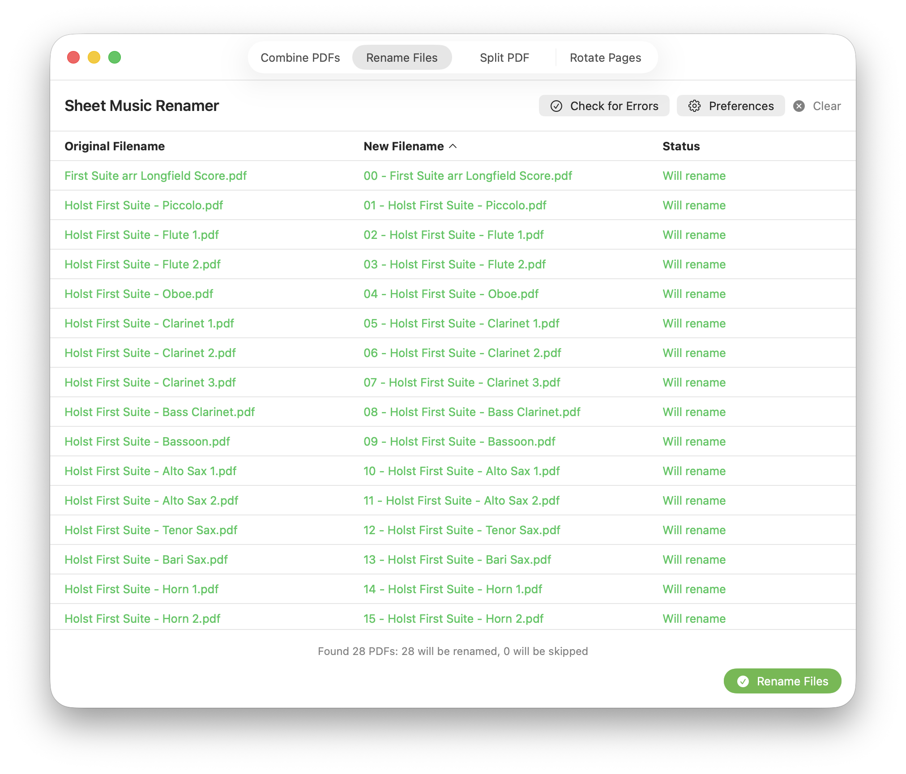
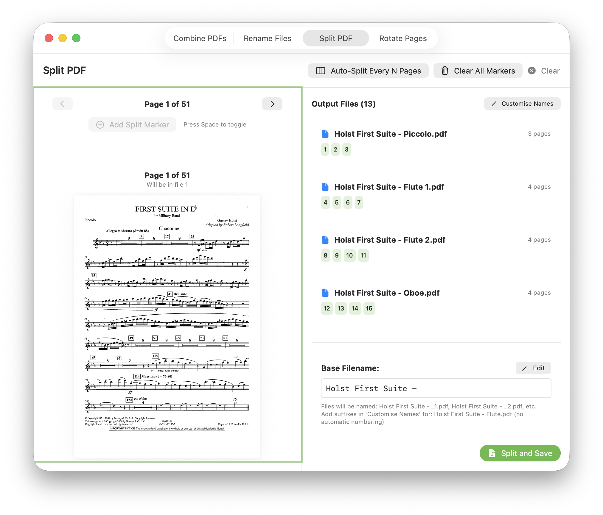
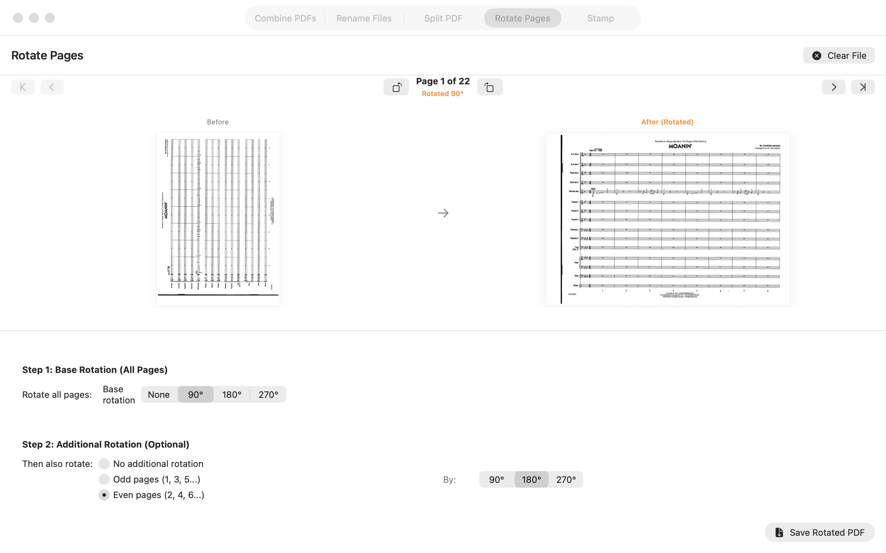

# Music PDF Manager

A powerful macOS application for managing music PDFs with three essential tools for musicians and music librarians: automatic file renaming based on instrument detection, PDF splitting, and page rotation.

## Features

### 📁 Sheet Music Renamer
Automatically organize your sheet music files by adding sequential prefixes based on detected instrument names.

- **Automatic instrument detection** from filenames
- **Sequential numbering** (Score = 00, instruments start at 01)
- **Three ensemble presets**: Wind Band, Jazz Band, and Orchestra
- **Customisable instrument order** - edit, reorder, add, or remove instruments
- **Manual override** for files that can't be auto-detected
- **Error checking** - rescan already-numbered files to find and fix mistakes
- **Smart detection** - handles "bass clarinet" vs "clarinet" correctly
- **Drag-and-drop folders** for quick importing
- **Sortable columns** - click headers to sort by original name, new name, or status
- **Live preview** - see all changes before executing

### ✂️ PDF Splitter
Split large PDF files into multiple documents with precision control.

- **Visual page preview** with keyboard navigation
- **Manual split markers** - mark pages where splits should occur
- **Auto-split mode** - automatically split every N pages
- **Custom filenames** for each output file
- **Base filename** with automatic numbering
- **Keyboard shortcuts** - Space to toggle markers, arrows to navigate
- **File preview cards** showing page ranges for each output

### 🔄 Page Rotator
Rotate PDF pages with flexible options for odd/even page handling.

- **Base rotation** for all pages (90°, 180°, 270°)
- **Additional rotation** for odd or even pages only
- **Before/after preview** for each page
- **Perfect for fixing scanned documents** with alternating orientations

## Screenshots


*Automatic sheet music file renaming with instrument detection*


*Split PDFs with visual preview and custom naming*


*Rotate pages with before/after preview*

## Installation

### Requirements
- macOS 14.0 (Sonoma) or later
- Xcode 15.0 or later (for building from source)

### Building from Source

1. Clone the repository:
```bash
git clone https://github.com/yourusername/music-pdf-manager.git
cd music-pdf-manager
```

2. Open in Xcode:
```bash
open MusicPDFManager.swift
```

3. Build and run:
   - Select your target device (Mac)
   - Press ⌘R or click the Run button

### Installing the App

Option 1: Build and copy to Applications folder
```bash
# After building in Xcode
cp -r ~/Library/Developer/Xcode/DerivedData/MusicPDFManager-*/Build/Products/Release/MusicPDFManager.app /Applications/
```

Option 2: Create an archive for distribution
- In Xcode: Product → Archive
- Follow the distribution wizard

## Usage

### Sheet Music Renamer

1. **Select a folder** containing your PDF sheet music files
   - Click "Choose Folder" or drag a folder onto the window
   
2. **Choose your ensemble type** (Band, Jazz, or Orchestra)
   - Each preset has a different instrument order
   
3. **Review the preview**
   - Green items will be renamed
   - Orange items need correction (rescan mode)
   - Blue items were manually assigned
   - Gray items will be skipped or are already correct
   
4. **Handle undetected files** (optional)
   - Double-click files marked "No instrument found" to manually assign a number
   
5. **Customise preferences** (optional)
   - Press ⌘, or click the Preferences button
   - Edit instrument order, add new instruments, or reorder existing ones
   
6. **Click "Rename Files"** to execute
   - No confirmation needed - you've already seen the preview!

#### Keyboard Shortcuts (Renamer)
- `⌘,` - Open Preferences
- Click column headers to sort (click again to reverse)

#### Example Workflow

Before:
```
Flute.pdf
Bb Clarinet 1.pdf
Alto Sax.pdf
Trumpet 1.pdf
Score.pdf
```

After:
```
00 - Score.pdf
01 - Flute.pdf
02 - Bb Clarinet 1.pdf
03 - Alto Sax.pdf
04 - Trumpet 1.pdf
```

### PDF Splitter

1. **Load a PDF** (drag & drop or click "Choose PDF")
2. **Navigate pages** using the preview or arrow buttons
3. **Add split markers**:
   - Click "Add Split Marker" or press Space
   - Or use "Auto-Split Every N Pages" for regular intervals
4. **Review the output files** in the right panel
5. **Customise filenames** (optional)
   - Set a base filename (auto-numbered by default: basename_1.pdf, basename_2.pdf)
   - Or click "Customise Names" to specify exact names (e.g., "As Winds Dance - " + "Flute" = "As Winds Dance - Flute.pdf")
6. **Click "Split and Save"** and choose an output folder

#### Keyboard Shortcuts (Splitter)
- `Space` - Toggle split marker on current page
- `←` / `→` - Navigate between pages
- **Tip**: Click on the preview area to activate keyboard shortcuts

### Page Rotator

1. **Load a PDF** (drag & drop or click "Choose PDF")
2. **Set base rotation** (applied to all pages)
3. **Set additional rotation** (optional, for odd or even pages)
4. **Preview the result** using page navigation
5. **Click "Save Rotated PDF"** and choose where to save

## Technical Details

### Built With
- **SwiftUI** - Modern declarative UI framework
- **PDFKit** - Native PDF handling
- **AppKit** - macOS-specific functionality

### Architecture
- **MVVM pattern** with ObservableObject view models
- **Type-safe enums** for rotation angles and operation types
- **Reactive updates** using Combine framework

### Instrument Detection Algorithm
1. Sorts instruments by length (longest first) to match specific names before generic ones
   - Example: "bass clarinet" matches before "clarinet"
2. Performs case-insensitive substring matching
3. Returns the first match found, preserving original position in instrument order

### Default Instrument Orders

The app includes three carefully curated preset orders:

**Wind Band**: Score, Woodwinds (Piccolo → Saxophones), Brass (Cornet → Tuba), Rhythm Section, Percussion, Strings

**Jazz Band**: Score, Vocals, Solos, Saxophones, Brass, Rhythm Section, Auxiliary Percussion

**Orchestra**: Score, Woodwinds, Brass, Timpani/Percussion, Keyboard/Harp, Strings

All orders are fully customisable in Preferences.

## Known Issues & Limitations

- **File naming**: Uses simple substring matching - very similar instrument names may need manual override
- **PDF rotation**: Mutates original page objects - always creates a new file
- **Drag & drop**: Currently only supports single folder/file drops

## Future Enhancements

- [ ] Batch processing for multiple folders
- [ ] Export/import custom instrument orders
- [ ] Undo functionality for renaming
- [ ] PDF merging tool
- [ ] Support for other file types (images, etc.)
- [ ] Automatic backup before renaming
- [ ] Regular expression support for advanced instrument detection

## Contributing

Contributions are welcome! Please feel free to submit a Pull Request. For major changes, please open an issue first to discuss what you would like to change.

### Development Setup

1. Fork the repository
2. Create your feature branch (`git checkout -b feature/AmazingFeature`)
3. Commit your changes (`git commit -m 'Add some AmazingFeature'`)
4. Push to the branch (`git push origin feature/AmazingFeature`)
5. Open a Pull Request

### Code Style
- Follow Swift API Design Guidelines
- Use meaningful variable names
- Comment complex logic
- Keep functions focused and small

## License

This project is licensed under the MIT License - see the [LICENSE](LICENSE) file for details.

## Acknowledgments

- Originally inspired by a Python-based sheet music renamer
- Built for musicians, by musicians
- Thanks to the macOS developer community for excellent SwiftUI resources

## Support

If you encounter any issues or have suggestions:
- Open an issue on GitHub
- Check existing issues for solutions
- Provide detailed steps to reproduce any bugs

## Author

Your Name - [@yourhandle](https://twitter.com/yourhandle)

Project Link: [https://github.com/yourusername/music-pdf-manager](https://github.com/yourusername/music-pdf-manager)

---

**Made with ♪ for musicians**
